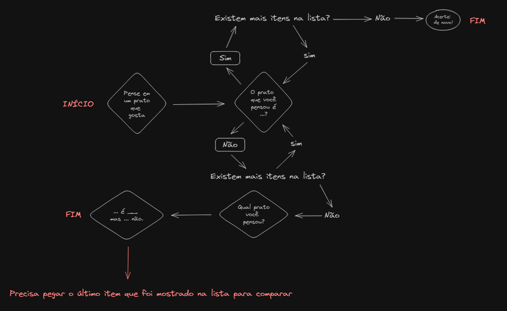
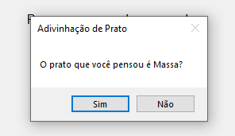

# Desafio

Repositório com as soluções criadas para o desafio do Jogo Gourmet.

## Roteiro de desenvolvimento

Primeiro foi mapeado como o jogo se comporta e as possíveis respostas.

Após o mapeamento foi criado um [projeto do tipo console application](https://github.com/Edu551/Desafio/tree/Console_app) para implementação da lógica, validações necessárias e criação de testes unitários. Para os testes foi utilizado o framework [NUnit](https://docs.nunit.org/articles/nunit/intro.html).

-   **Jogo descobriu o prato**
    

-   **Jogo não descobriu o prato, então o usuário adiciona o prato que estava pensando**
    

Após validações foi criado um projeto utilizando [Windows Forms](https://github.com/Edu551/Desafio/tree/Windows_forms) para gerar uma interface gráfica.

-   **Tela inicial**
     
    
     

-   **Tela de questionário**
     
    
     

-   **Tela de acerto**
     
    
     

-   **Tela de adição de prato caso o jogo não adivinhe**
     
    
     
